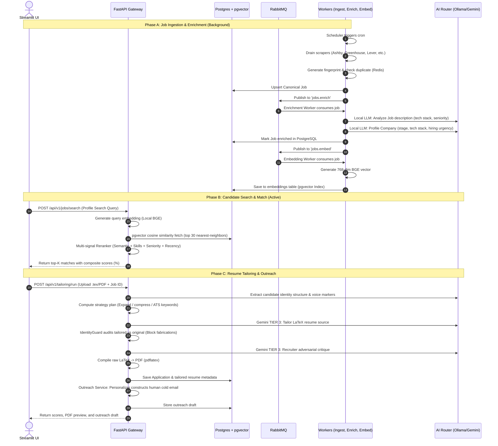

# Job Acquisition Operating System (Job OS) — Project Guide

This document provides a comprehensive overview of the **Job Acquisition Operating System**, its architectural layers, the end-to-end data flow, and the precise significance of every key file in the project.

---

## 1. Project Philosophy & Architecture

The **Job Acquisition OS** is a highly engineered, production-ready system designed to automate the job search pipeline: **Scraping → Deduplication → AI Enrichment → Semantic Matching → ATS Resume Tailoring → Cold Outreach Drafting → Funnel Analytics**.

It adheres to three core design rules:
1. **Local-First, Cost-Efficient AI:** Heavy-lifting tasks (scraping, deduplication, semantic search, company profiling, skill overlap matching, and final score math) run locally on lightweight models (Ollama, BGE embeddings, pgvector). Costly cloud APIs (Gemini) are reserved strictly for the final 3% of the pipeline (resume tailoring and recruiter critique passes).
2. **Zero Fabrication (Authenticity Guard):** The tailoring engine employs a post-execution adversarial auditor (`IdentityGuard`) to guarantee that the LLM never fabricates experience, dates, or skills that the candidate does not actually possess.
3. **LaTeX-Native Fidelity:** Tailors directly at the source code level (`.tex` files) and compiles them locally using `pdflatex` to output recruiter-grade PDFs instantly.

---

## 2. End-to-End Data Flow

Here is how data flows through the application:

---

## 3. Directory & File Significance

Below is the directory breakdown explaining the significance and responsibility of each key file:

### 📂 `src/ai/` — Inference Routing & Clients
This layer wraps LLM inference, ensuring intelligent fallback, caching, and cost-control.
* **[router.py](file:///d:/job_acquisition_os/src/ai/router.py):** The master AI router. Classifies tasks into `EXTRACTION`, `CLASSIFICATION`, `ANALYSIS` (routed locally to Ollama), or `GENERATION`, `CRITIQUE` (routed to Gemini). It intercepts identical prompts via SHA-256 caching.
* **[local_llm.py](file:///d:/job_acquisition_os/src/ai/local_llm.py):** Asynchronous Ollama client wrapper. Interacts with local models like `qwen2.5:7b-instruct`.
* **[gemini_client.py](file:///d:/job_acquisition_os/src/ai/gemini_client.py):** Async wrapper for Google's Gemini SDK. Handles automatic exponential backoff retries and handles 429 rate limits gracefully.
* **[cache.py](file:///d:/job_acquisition_os/src/ai/cache.py):** Redis cache coordinator. Implements synchronous and asynchronous caching rules with optimized TTLs (e.g., 30 days for embeddings, 7 days for company profiles).

### 📂 `src/adapters/` — Ingestion Adapters
Each adapter parses raw job boards into a single standard data model.
* **[base.py](file:///d:/job_acquisition_os/src/adapters/base.py):** Declares the `CanonicalJob` schema and the `AbstractJobAdapter` interface. The `fingerprint` property computes a stable unique hash (`source:source_id:title`) for exact deduplication.
* **[greenhouse.py](file:///d:/job_acquisition_os/src/adapters/greenhouse.py) / [lever.py](file:///d:/job_acquisition_os/src/adapters/lever.py) / [ashby.py](file:///d:/job_acquisition_os/src/adapters/ashby.py) / [yc_jobs.py](file:///d:/job_acquisition_os/src/adapters/yc_jobs.py):** Custom, high-speed HTTP JSON API adapters for major ATS platforms. 
* **[hackernews.py](file:///d:/job_acquisition_os/src/adapters/hackernews.py):** Algolia API parser that extracts job posts from monthly *"Ask HN: Who is Hiring?"* threads, sanitizing HTML and inferring company domains.

### 📂 `src/ingestion/` — Ingestion Pipeline
* **[pipeline.py](file:///d:/job_acquisition_os/src/ingestion/pipeline.py):** Coordinates concurrent scraping jobs, filters out duplicates on the fly, persists new jobs in Postgres, and queues them for enrichment.
* **[deduplicator.py](file:///d:/job_acquisition_os/src/ingestion/deduplicator.py):** Redis Set-based Bloom filter layer that performs $O(1)$ lookup checks for previously seen fingerprints.
* **[scheduler.py](file:///d:/job_acquisition_os/src/ingestion/scheduler.py):** Sets up the `AsyncIOScheduler` cron to trigger a full job scraping sweep every 4 hours.

### 📂 `src/enrichment/` — Raw Data Processing
* **[jd_analyzer.py](file:///d:/job_acquisition_os/src/enrichment/jd_analyzer.py):** Employs local models to parse a job description into structured entities (role type, seniority, required tech stack, and ATS keyword phrases).
* **[company_enricher.py](file:///d:/job_acquisition_os/src/enrichment/company_enricher.py):** Leverages web contexts to identify funding stages, engineering values, tech stacks, and hiring urgency metrics for a company.

### 📂 `src/matching/` — Semantic Ranker
* **[embedder.py](file:///d:/job_acquisition_os/src/matching/embedder.py):** Houses `LocalEmbedder` which loads a local `SentenceTransformer` model (e.g., `BAAI/bge-base-en-v1.5`) and caches embeddings inside Redis.
* **[ranker.py](file:///d:/job_acquisition_os/src/matching/ranker.py):** Implements a weighted composite scoring system (45% Semantic Cosine, 30% Jaccard Skill Overlap, 15% Seniority Alignment, 10% Date Recency).
* **[semantic_search.py](file:///d:/job_acquisition_os/src/matching/semantic_search.py):** Generates and executes native pgvector SQL queries (`ORDER BY vector <=> :vec`) utilizing PostgreSQL index speed instead of in-memory lists.

### 📂 `src/tailoring/` — LaTeX Resume Strategizer & Auditor
* **[parser.py](file:///d:/job_acquisition_os/src/tailoring/parser.py):** Seamlessly extracts structured text from `.pdf`, `.docx`, and `.tex` source files.
* **[strategy_generator.py](file:///d:/job_acquisition_os/src/tailoring/stratergy_generator.py):** Pre-computes how sections should be weighed and reordered (e.g., highlighting research sections for R&D roles or backend keywords for Platform Engineering JDs).
* **[identity_guard.py](file:///d:/job_acquisition_os/src/tailoring/identity_guard.py):** Inspects tailored output to flag keyword stuffing (>5x density), fabrication of skills, company erasure, or tone preservation failures.
* **[latex_compiler.py](file:///d:/job_acquisition_os/src/tailoring/latex_compiler.py):** Manages local temporary compilation directories to run `pdflatex` twice (to resolve cross-references) and outputs finished binary PDFs.
* **[scorer.py](file:///d:/job_acquisition_os/src/tailoring/scorer.py):** A 5-dimensional math score assessor measuring formatting, keywords, credibility density (action verbs, metrics), and authenticity metrics.

### 📂 `src/outreach/` — Outreach drafting
* **[personalizer.py](file:///d:/job_acquisition_os/src/outreach/personalizer.py):** Instructs the LLM to draft cold emails under 120 words that omit standard template cliches (e.g. *"I hope this email finds you well"*) and hook the reader using tailored tech-stack indicators.
* **[contact_finder.py](file:///d:/job_acquisition_os/src/outreach/contact_finder.py):** Proposes pattern-based email candidates (e.g. `jobs@domain.com`, `careers@domain.com`).

### 📂 `src/tracking/` — State & Funnel Tracking
* **[tracker.py](file:///d:/job_acquisition_os/src/tracking/tracker.py):** Enforces transition safeguards for the application status lifecycle: `discovered → applied → replied → interviewing → offered → rejected | ghosted`.
* **[analytics.py](file:///d:/job_acquisition_os/src/tracking/analytics.py):** Measures metrics like conversion ratios, response funnel charts, and ranks the highest-yielding job boards.

### 📂 `src/database/` — Storage Layer
* **[connection.py](file:///d:/job_acquisition_os/src/database/connection.py):** Generates async pgvector-ready DB engine instances and supplies request-scoped sessions.
* **`models/` ([jobs.py](file:///d:/job_acquisition_os/src/database/models/jobs.py) / [candidates.py](file:///d:/job_acquisition_os/src/database/models/candidates.py)):** Defines ORM tables (Jobs, Companies, Candidates, Applications, Outreach, and Embeddings) using SQLAlchemy 2.0.
* **`repositories/` ([job_repo.py](file:///d:/job_acquisition_os/src/database/repositories/job_repo.py)):** Coordinates transaction blocks and executes DB query routines.

### 📂 `src/services/` & `workflows/` — Orchestration Orchestrators
* **[job_acquisition.py](file:///d:/job_acquisition_os/src/workflows/job_aquisition.py):** The master workflow combining all pipeline stages. Executes matching, triggers the tailoring workflow, initiates database records, drafts outreach, and structures the summary returned to the client.
* **[tailoring.py](file:///d:/job_acquisition_os/src/workflows/tailoring.py):** Resume tailoring orchestration flow coordinating extraction, strategic layout calculations, Gemini-based tailoring, audit sweeps, critique generation, and compilation.
* **[job_service.py](file:///d:/job_acquisition_os/src/services/job_service.py):** Coordinates embedding generation, pgvector retrieval, and reranking.

### 📂 `src/api/` — Web Services Layer
* **[main.py](file:///d:/job_acquisition_os/src/api/routes/main.py):** Registers FastAPI middlewares (CORs, request tracing), lifespan hooks (ensures db extensions are available), and mounts routes.
* **[dependencies.py](file:///d:/job_acquisition_os/src/api/routes/dependencies.py):** Configures Dependency Injection singletons for HTTP Clients, routers, and embedding instances.
* **`routes/` ([tailoring.py](file:///d:/job_acquisition_os/src/api/routes/tailoring.py) / [jobs.py](file:///d:/job_acquisition_os/src/api/routes/jobs.py)):** Handles requests for respective resources, streams completed PDF binaries, and compiles source files.

### 📂 `src/ui/` — Interactive UI
* **[app.py](file:///d:/job_acquisition_os/src/ui/app.py):** The multi-page Streamlit portal sidebar coordinator.
* **`pages/` ([1_JobDiscovery.py](file:///d:/job_acquisition_os/src/ui/pages/1_JobDiscovery.py) / [2_Resume_Tailor.py](file:///d:/job_acquisition_os/src/ui/pages/2_Resume_Tailor.py)):** Page definitions rendering forms, visual charts, and downloading source configurations.

### 📂 `src/queues/` — Asynchronous Queue Engine
* **[publisher.py](file:///d:/job_acquisition_os/src/queues/publisher.py) / [consumer.py](file:///d:/job_acquisition_os/src/queues/consumer.py):** Asynchronous wrappers around `aio-pika` establishing exchange channels, persistent queues, and QoS settings.
* **`workers/` ([enrichment_worker.py](file:///d:/job_acquisition_os/src/queues/workers/enrichment_worer.py)):** CPU/GPU-bound background workers consuming tasks sequentially (e.g. GPU embeddings are consumed one-at-a-time to prevent VRAM memory exhaustion).
